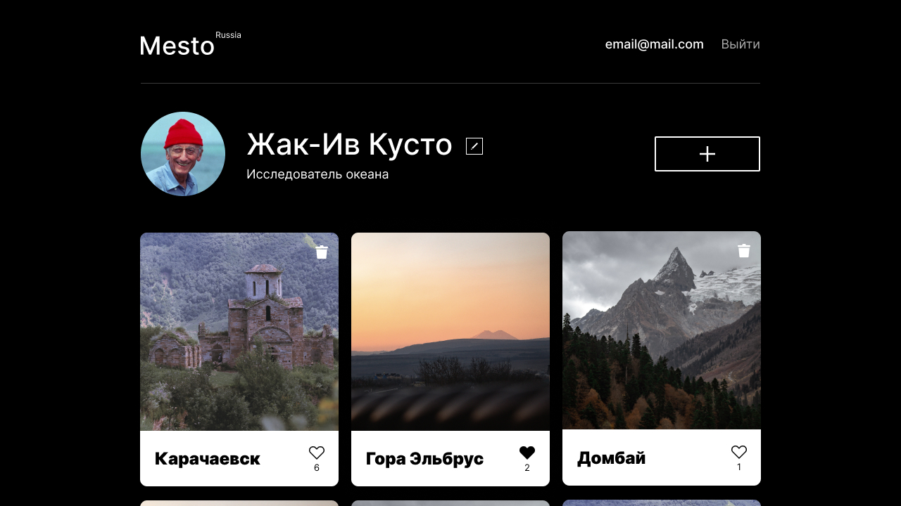

# Проект Место

* Описание проекта
* Используемые технологии
* Планы по доработке
* Ссылка на Github
* Макет Figma

**Описание проекта**

Проект позволяет добавлять к свою коллекцию понравившиеся фотографии. Пользователям доступна регистрация и авторизация. Зарегистрированные пользователи могут добавлять карточки, удалять карточки только добавленные ими, раскрывать их на весь экран. Также есть возможность менять свой аватар, имя и род занятий пользователя. 

**Используемые технологии**

React, React Hooks, React router

**Планы по доработке**

* Дописать мобильную версию шапки страницы. 
* Переписать приложение с использованием Redux
* Написать сервер с использованием Node.js

**Github Pages**

* [Ссылка на проект Github](https://denisdimov.github.io/react-mesto-auth/)

**Макет Figma**

* [Ссылка на макет в Figma](https://www.figma.com/file/5H3gsn5lIGPwzBPby9jAOo/JavaScript.-Sprint-12?node-id=0%3A1)

